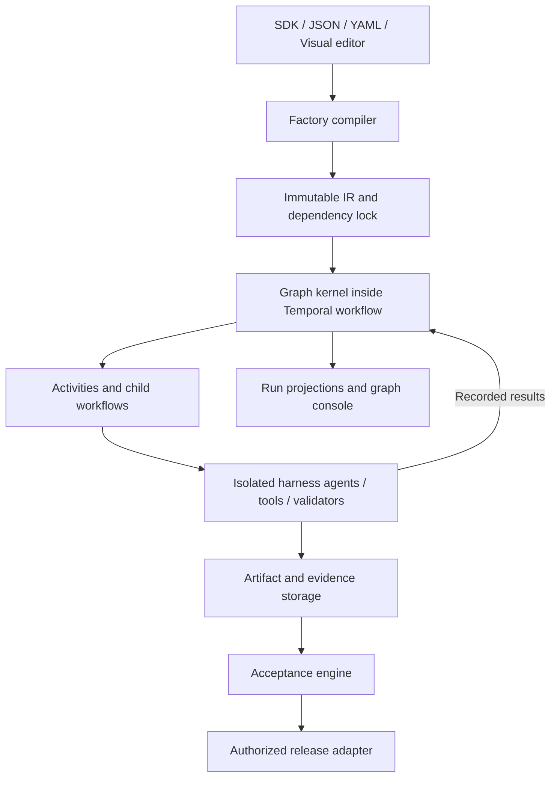

# Composable Factory Platform for EZHarness

Date: 2026-09-12; amended 2026-09-13  
Status: architecture and implementation plan; first-, second-, and third-review gaps resolved in specification; not implemented  
Repository baseline: `main` at `2588c9f19`. The first two reviews and the first amendment read `93598600a`, the tip of a fix branch 14 commits behind main; every code claim below was re-verified against main on 2026-09-13.

The [launch contracts](2026-09-12-composable-factory-platform-contracts.md) are a required part of this plan and the canonical source for detailed protocols, limits, roles, and proof IDs F01–F13. The [resolution map](#16-review-resolution-map) links every finding from the [first review](2026-09-12-composable-factory-platform-review.md), the [second review](2026-09-12-composable-factory-platform-review-2.md), and the [third review](2026-09-12-composable-factory-platform-review-3.md) to its contract and stage. Runtime proof remains pending. See the [factory glossary](../../CONTEXT.md), the [execution-boundary decision](../decisions/2026-09-12-factory-execution-boundaries.md), and the [editor graph-library decision](../decisions/2026-09-12-factory-editor-graph-library.md).

## 1. Purpose and agreed scope

Build a general-purpose factory product within EZHarness. A factory structures work, controls its execution, checks its output against an acceptance contract, and permits release only under sufficient evidence and current authority.

The core principle is: **outputs may vary; accepted properties should remain stable.** Acceptance establishes the properties checked by a specific contract. It does not establish universal correctness.

Decisions agreed during planning:

- Build a separate factory API, definition model, run records, and console. Keep existing workflows and the ez-factory console operational.
- Launch the full platform with production code, image, and data domain packs, a visual editor, and live run inspection.
- Support hosted and self-hosted operation.
- Support third-party node implementations and domain packs through versioned package contracts and isolated execution.
- Target 100 tenants, 1,000 active runs, and up to 10,000 expanded nodes per run. These are validation targets, not measured capacity claims.
- Permit automatic release within prior, scoped, revocable authorization. Otherwise require approval of the exact release request.
- Select Temporal from the documentation comparison. Runtime recovery and performance still require implementation tests.
- Own a deterministic graph kernel. Use Temporal for durable execution and existing harness modules for agent and tool execution.

This document and its linked launch contracts specify the complete launch, delivered in stages. Finishing only the kernel does not complete the platform. They are the authoritative launch scope; an unlinked earlier handoff is not an additional source of requirements.

Hosted operation uses one isolated harness installation and product database per tenant. Self-hosted operation uses the same tenant boundary in one installation. Existing project/extension behavior stays inside that boundary. Shared infrastructure does not share tenant credentials or product authority. The roles and API rules are fixed in [C01](2026-09-12-composable-factory-platform-contracts.md#c01-tenant-and-authority).

A factory-enabled deployment is a multi-service deployment. Its required services are listed once, in the C09 readiness rule, and they cannot degrade gracefully. The single-container, embedded-database deployment remains the default for installations that do not enable factories; it cannot run factories and reports them unavailable. Hosted operation adds a control plane that provisions and operates tenant installations; it is specified in [C12](2026-09-12-composable-factory-platform-contracts.md#c12-hosted-control-plane-and-provisioning). The [execution-boundary decision](../decisions/2026-09-12-factory-execution-boundaries.md) records the cost of both choices.

## 2. Assessment of the architecture and existing harness

### What works well

Keep the separation between Work Graph, Agent Runtime, and Assurance. Keep typed composition, immutable versions, bounded loops, structured evidence, and separation of generation from release authority. These are properties of the factory design, not features of the existing workflow engine; the inventory below states which of them exist today.

Keep the canonical Factory Intermediate Representation (IR). Every authoring method must produce the same validated representation. Domain packs supply different definitions of correctness without changing the kernel.

### Existing module inventory

Verified against main `2588c9f19` on 2026-09-13 by reading the code, not the names. Reuse only what this table and C13 permit.

| Existing module | Verified contract | Reuse decision |
| --- | --- | --- |
| [Condition evaluation](../../src/runtime/workflow-condition.ts) | Pure declarative tree, nine operators, no code evaluation | Reuse directly as the basis of the C07 expression AST |
| [Nested dependency closure](../../src/runtime/workflow-closure.ts) | Pure closure walk with one type-only import | Reuse directly |
| [Ownership ladder](../../src/runtime/workflow-scope.ts) | Pure visibility ladder; its policy admits every instance user to `project` visibility | Reuse the code; do not reuse the policy (C01 replaces it) |
| [Capability hash](../../src/runtime/workflow-capability-hash.ts) and [consent reconcile](../../src/runtime/workflow-consent-reconcile.ts) | Pure digest over delegation facts and the capability closure; re-consent only on widening | Reuse as the pattern for contract-digest binding in C04 and C07 |
| [Definition hash](../../src/runtime/workflow-definition-hash.ts) | Pure SHA-256 over sorted keys; the only drift guard that fires on resume | Reuse the approach under C07's RFC 8785 rule |
| Approval guard and relay | Pure; the surrounding answer and sweep modules import the legacy claim functions | Reuse the pure parts behind an adapter; factory approvals are new records (C04) |
| Nested resolver and [workflow executor](../../src/runtime/workflow-executor.ts) dispatch | Coupled to `parent_run_id` walks and the `nested:` idempotency key | Not reused; the legacy adapter calls the executor as a black box (C10) |
| Resume claims ([workflow runner](../../src/runtime/workflow-runner.ts)) | Compare-and-swap lease on `suspended` runs, per-daemon heartbeat, PID lockfile | Not reused; Temporal owns factory execution. The lease pattern informs C03 fencing |
| "Bounded loops" ([validator](../../src/runtime/workflow-validator.ts) clamp) | Iteration ceiling of 25 only; no elapsed-time bound inside a loop; token check at batch boundaries for delegated runs only | Not reused; C07 loops are new code with iteration, time, and budget bounds |
| "Model routing" | `step.model ?? workflow.defaultModel`; `src/runtime/routing/` serves the chat path only | Does not exist for workflows; factory model selection is new code |
| "Version records" | Append-only history rows; precedence over the hash is unimplemented; definitions are mutable and resolved by name; nested children resolve by name at dispatch | Not reused; pinned immutable versions are new work (section 5) |
| [Reference resolution](../../src/runtime/workflow-refs.ts) | Five reference roots; `$prev` is defined by the batch and has no meaning under independent branch progress | Reuse the path-resolution code without `$prev` |
| [Current factory console](../features/extensions/ez-factory.md) | `schemaVersion: 4` served runtime under the v4 Podman runner with `/project` and `/data` container mounts; renders Hub pages over the workflow engine; executes nothing itself; install-wide ownerless job store; digest-named artifact files | Kept operational; not a host for the new console (section 11); not surfaced inside factory projects (C10) |

Not present anywhere in the repository: a transition-function or command-identity pattern, a tenant model, a feature-flag system, an S3 object-storage client, a Node.js or Python source tree, gVisor, a GPU profile, Kubernetes artifacts, an outbound human notification channel, or a metrics endpoint. Each is new work with an owning contract and stage. Extract shared logic rather than copying it into a second implementation.

### Extension v4 lifecycle (reuse, do not rebuild)

Commit #246 on main shipped an extension v4 lifecycle that the earlier baseline did not have: rootless Podman isolation with a deny-by-default seccomp profile and a fail-closed kernel probe; manifest discovery inside the container after digest verification; a durable, human-only, single-use release approval bound to a digest, exact grants, and an expected generation; a GitHub pull-request broker with a digest-bound proposal, atomic claim, host-held token, and never-retried uncertain outcome; a credential broker that issues opaque 60-second handles; a transactional outbox with an explicit unknown-outcome state; fenced runtime locks with a quarantined state; a content-addressed blob store behind an injectable interface; a bounded idempotency key with input-digest conflict detection; a fail-closed transactional audit helper; and a human-session gate with 202-plus-queued-operation semantics on every route that activates code. Its authoritative description is `src/extensions/v4/README.md` and `docs/extension-system-v4-plan.md`.

The factory reuses or extends every one of these. [C13](2026-09-12-composable-factory-platform-contracts.md#c13-reuse-of-the-extension-v4-lifecycle) names the module for each factory concept and the verdict: reuse, extend, or new. A parallel implementation of any listed concept is rejected in review, and F13 tests for it.

### What needs correction

- The current executor sorts nodes into fixed batches and waits for each batch with `Promise.all`. A successor can wait for unrelated work in the same batch. Without `dependsOn`, execution is strictly sequential. The first failure cancels the whole run. `$prev` is defined by the batch. New factory execution must advance each eligible branch independently.
- The current runner is safe on more than one host through a lease compare-and-swap, but it has no coordination, fairness, or work distribution. Its orphan recovery runs only at web boot. A run orphaned inside a batch is terminalized to `error` with `resumable=false`, including its completed steps. A run orphaned when a peer host dies stays `running` until some host restarts. `awaiting_approval` is terminal. Preserve that behavior for legacy workflows outside factories; the legacy adapter in C10 must surface these limits exactly, and a factory wrapper must not claim to improve them. The periodic orphan sweep, the caller-facing idempotency key, and the discrimination of a unique-key conflict from a persistence failure, all in C10, are the only legacy-engine changes in launch scope.
- A compiler can validate declared authority but cannot enforce runner isolation. Runtime controls must enforce the declarations.
- A quorum of model judges is a voting rule. Correlated judges can share the same error. Record evaluator provenance and do not present votes as calibrated confidence.
- Execution state, validation outcome, acceptance, and release are separate concepts. Do not combine them into one large status enum.
- Dynamic fan-out may instantiate approved templates. Arbitrary replacement of the running graph requires a new validated revision and any additional authorization.
- Graph presentation hierarchy and durable execution hierarchy need not match.
- Durable execution does not make arbitrary external writes exactly-once. Release adapters must handle uncertain outcomes.

## 3. Runtime selection

### Decision: Temporal

Temporal best fits the selected scope because it provides explicit mechanisms for persistent task delivery, independent workers, durable waits, child execution, cancellation, and worker versioning. Worker queues support routing work to suitable pools and let workers pull work when they have capacity. Workers do not require exposed inbound ports. See [task queues](https://docs.temporal.io/task-queue), [TypeScript capabilities](https://docs.temporal.io/develop/typescript), and [versioning](https://docs.temporal.io/develop/typescript/workflows/versioning).

The reason is lifecycle complexity, not graph traversal or the headline concurrency target. Long approvals, rolling upgrades, uncertain operations, and different worker types are the difficult cases.

This is an architectural judgment based on primary documentation. No comparative benchmark or recovery prototype was run during planning.

| Option | Strength | Decision for this platform |
| --- | --- | --- |
| Temporal | Durable orchestration across independent workers; explicit lifecycle controls | Selected production adapter |
| Restate | Durable service calls, keyed state, Bun support, compact deployment packaging | Strongest alternative; not a second launch runtime |
| DBOS | Durable functions and queues using PostgreSQL | Distributed recovery coordination makes its total footprint less simple than the database-only description suggests |
| Inngest | Event-driven durable functions and self-hosting support | No demonstrated advantage for this full platform scope |
| Trigger.dev | Integrated task execution product | Hosted and self-hosted feature differences weaken the fit |
| Existing runner | Harness integration and current workflow behavior | Legacy adapter only; do not build a new distributed execution engine around it |

Restate is a serious alternative, not an incapable fallback. It supports durable calls and stateful virtual objects, its SDK supports Bun, and its server can run as a single binary or a replicated cluster. Production clusters still need storage, snapshots, and capacity planning. Both Restate and Temporal require careful version management. See [Restate services](https://docs.restate.dev/develop/ts/services), [self-hosting](https://docs.restate.dev/server/overview), and [versioning](https://docs.restate.dev/services/versioning).

DBOS checkpoints into PostgreSQL, but its documentation states that distributed recovery requires coordination, through Conductor or operator-managed mechanisms. See [DBOS architecture](https://docs.dbos.dev/architecture). Inngest documents qualifications on direct self-hosted support: [self-hosting](https://www.inngest.com/docs/self-hosting). Trigger.dev currently lists checkpoints and automatic scaling as cloud-only in its [self-hosted feature comparison](https://trigger.dev/docs/self-hosting/overview).

Keep a narrow runtime adapter and conformance suite. Do not flatten all engines into an artificial lowest common denominator. A future adapter must preserve the declared factory semantics or reject unsupported plans. Replacing an engine routes new runs to the new adapter; active history migration is not promised.

### Temporal constraints that affect the design

Temporal documents execution history limits of 51,200 events or 50 MB, and default limits of 2,000 pending operations for several operation types. Partition large execution histories and bound fan-out instead of raising limits as the initial solution. See [execution limits](https://docs.temporal.io/workflow-execution/limits).

Child workflows add history and coordination overhead. Use them for independent recovery, worker routing, or history partitioning, rather than merely to match visual nesting. A parent continuation does not automatically retain ongoing children as children of the new run. Launch continues only at quiescent boundaries with no active activity or child in that interpreter; live-child handoff is not a launch mechanism. Payload, partition, and continuation limits are fixed in [C08](2026-09-12-composable-factory-platform-contracts.md#c08-payloads-partitions-and-continuation). See [child workflows](https://docs.temporal.io/child-workflows).

## 4. Architecture and sources of truth



| Module | Owns |
| --- | --- |
| Compiler | Schema checks, graph checks, dependency pinning, static policy checks |
| Graph kernel | Readiness, branches, joins, iteration, expansion, deterministic state transitions |
| Temporal adapter | Durable commands, timers, waits, task delivery, recovery |
| Harness execution adapters | Agents, model access, tools, workspace operations |
| Admission (tenant gateway) | Permission checks, budget reservations, admission requests to the pool service (C03) |
| Assurance module | Evidence validation and acceptance decisions |
| Release broker (a gateway role; extends the v4 pull-request and credential brokers) | Current authorization, operation identity, sole holder of publish credentials, execution receipt, reconciliation (C04) |
| Product storage | Definitions, package locks, artifacts, evidence, approvals, release records, query projections |
| Pool admission service | Cross-tenant compute and provider concurrency ledger keyed by opaque tenant ID; fairness; GPU host allocation (C03) |
| Execution gateway | Attempt tokens, operation journal, and the provider broker, release broker, fetch proxy, and archive writer roles (C02) |
| Host supervisor | Runner launch, heartbeat, and kill through the container runtime; holds host identity only, never tenant state (C05) |
| Outbox dispatcher | Delivers product-side commands and decisions to Temporal with stable identities; extracts the v4 delivery-queue pattern (C02) |
| Control plane | Hosted tenant provisioning, directory, ingress mapping, fleet operations (C12) |

Temporal owns authoritative execution progress. PostgreSQL run views are projections, not a second scheduler. PostgreSQL owns product facts such as acceptance decisions and release receipts. Each transition involving those facts returns a recorded result to orchestration.

Process topology is fixed in [C02](2026-09-12-composable-factory-platform-contracts.md#c02-worker-bridge-and-operation-recovery). Only the Node.js orchestration process links the Temporal SDK; the Bun harness, API, and gateway never do. Product-side requests reach Temporal only through the transactional outbox and its dispatcher.

Use stable command IDs, deduplicated event handling, and a transactional outbox where a database transaction must cause an execution command. Projection failures cannot roll back successful external work or silently cause it to repeat. Projection consumers must be recoverable, and their lag must be visible. [C06](2026-09-12-composable-factory-platform-contracts.md#c06-durable-records-retention-and-restore) defines the canonical execution audit, contiguous projection cursors, retention, independent release archive, backup barrier, and restore epoch. Projections are rebuilt from durable audit records after ordinary Temporal history expires.

## 5. Factory IR, authoring, and compiler

Create a domain-neutral factory kernel package with one schema source for runtime validation, SDK types, compiler inputs, and editor forms. Publish its authoring surface as `@ezcorp/factory-sdk`.

Support TypeScript authoring, JSON/YAML import, and the visual editor at launch. Python runners use a language-neutral runner contract. A separate Python authoring SDK is deferred.

The IR describes:

- Typed input and output ports, node identities, and explicit data bindings.
- Dependencies, branches, joins, maps, loops, and subfactory references.
- Agent execution envelopes and task implementations.
- Capabilities, effects, resource classes, budgets, deadlines, and retry policies.
- Acceptance contracts, validator requirements, approvals, and release constraints.
- Schema version, factory version, package digests, and the resolved dependency closure.

Published definitions are immutable. Editing creates a draft and then a new version. Pin the transitive dependency closure when publishing; an active run never resolves a moving `latest` reference.

Compiler stages:

1. Parse and validate the schema; reject unknown execution fields.
2. Resolve and pin factory and package references.
3. Check graph cycles, missing nodes, ports, and reference reachability.
4. Check port compatibility using the supported JSON Schema subset. Require an explicit conversion node when compatibility cannot be established.
5. Check bounds, capabilities, effects, and child authority.
6. Check that release requires an accepted artifact and that protected acceptance criteria are outside generator authority.
7. Emit immutable IR, dependency indexes, and actionable diagnostics with node and field locations.

The supported value/schema subset, canonical hashing, expression AST, runtime input/output checks, and exact control semantics are specified in [C07](2026-09-12-composable-factory-platform-contracts.md#c07-ir-values-and-control-semantics). Golden reference definitions must compile in stage 1 before their real runners are added.

Keep executable expressions declarative and bounded. Do not evaluate arbitrary JavaScript from an imported definition or editor field. Separate editor positions and presentation metadata from execution semantics.

## 6. Graph execution kernel

### Central interface

The kernel is a deterministic transition module:

```typescript
advance(plan, state, event) => {
  nextState,
  commands,
}
```

It performs no network calls, database writes, model calls, or reads of ambient time. The same plan, state, and recorded event sequence produce the same decisions. The Temporal adapter executes commands and returns outcomes as events.

No transition-function or command-identity pattern exists in the repository today. The nearest module, the SDK loop-core `transition`, returns state without commands and is not a template. Stage 1 builds the kernel as new code under C07; it extracts nothing from the workflow executor.

Events include node completion, attempt failure, approval decisions, timer expiry, admission results, and cancellation. Commands request task execution, admission, timers, child execution, cancellation, or completion.

Assign stable identities to node instances, commands, and attempts. A retry is a new attempt for the same logical operation; a repair is a new candidate and iteration. Duplicate events and stale attempt results cannot advance a node twice. External-operation identity remains stable across retries where reconciliation requires it. [C02](2026-09-12-composable-factory-platform-contracts.md#c02-worker-bridge-and-operation-recovery) assigns product attempt control to the kernel; execution activities do not add another automatic retry loop. Transport retries preserve their request identity.

### Readiness and admission

Compile adjacency indexes and dependency counters once. A completed node updates its affected successors; it does not cause a full graph scan. Preserve explicit branch and join state rather than treating every predecessor as a simple success counter.

For `A → B → D` and `A → C → E`, D becomes ready after B finishes even if C is still running. No fixed layer-wide barrier is implied.

The durable budget/compute acquisition sequence, lease fencing, settlement, capacity reclamation, and tenant fairness rules are defined in [C03](2026-09-12-composable-factory-platform-contracts.md#c03-admission-and-reservations). Parent/approval waits consume no compute slot, and an expired lease alone does not prove capacity is free.

Keep `ready` separate from `admitted`. Dependencies make work ready; permission, budget, and capacity determine when it may start. Order equally eligible work by explicit priority and stable node identity. Recorded completion order may affect a race, but replay must reproduce the recorded choice.

### Control vocabulary

| Construct | Contract |
| --- | --- |
| Task | Executes an agent, tool, transform, or validator through a declared runner contract |
| Branch | Selects explicit paths from recorded inputs; unselected paths become skipped |
| Join | Resolves an explicit all, any, or quorum condition |
| Map | Instantiates a pinned template over a bounded, snapshotted collection |
| Loop | Repeats a child graph under iteration, time, and applicable budget bounds |
| Subfactory | Invokes a pinned factory through typed ports |
| Approval | Waits for an authorized decision with expiry behavior |
| Acceptance | Requests an evidence-based decision for the pinned contract |
| Release | Requests a separately authorized external operation |

Third-party authors add task implementations, schemas, validators, and domain packs. They do not inject arbitrary scheduling code. New control behavior composes from the supported vocabulary or requires a versioned kernel change.

### Joins, skipped paths, and failure

- `all` requires every selected required input to succeed. Unselected branch inputs are excluded only where the compiled branch structure permits that behavior.
- `any` and quorum joins declare which outcomes qualify. A generic successful task response is not automatically a passing validator result.
- Fail a join when the required outcome is impossible. Do not wait indefinitely for a quorum that can no longer be reached.
- Record the exact winning inputs. Request cancellation of remaining work by default and account for work already performed.
- Cancellation is cooperative. A requested cancellation is not proof that an in-flight external action stopped.
- Downstream ports cannot read missing outputs from skipped paths. Require explicit optional inputs or a branch merge.

### Data flow, loops, and maps

Pass immutable named outputs and artifact references. Avoid a shared mutable state object that every task may write. Parallel output merging occurs through explicit reducers.

Map input is snapshotted before expansion. Each item receives a stable identity derived from the map instance and input position. Duplicate values are distinct items. Enforce maximum item count, total expanded-node count, and concurrent children. Default reduction requires all items to succeed and preserves input order. Partial collection must explicitly return per-item outcomes. Empty maps produce an empty collection.

Loops keep the outer graph acyclic. Each iteration is a new scoped graph instance. Require iteration and elapsed-time bounds and, for paid work, budget bounds. Exhaustion fails or escalates according to the contract; it cannot silently certify a candidate.

The expression language has no arithmetic. A loop's `until` and `nextInput` select and compare recorded values only. Any derived value between iterations, including a counter, is produced by a task node. The kernel owns the iteration index and exposes it as a read-only reference.

Replanning produces a new validated child plan within existing authority. Broader permissions or acceptance changes require explicit authorization. Completed history remains immutable.

## 7. Subfactory composition and versioning

Every subfactory has typed ports, a logical run identity, a parent link, its own acceptance contract, and a pinned version. This is independent of whether it maps to a Temporal child workflow.

- Child authority is the intersection of parent authority, installed package grants, and current policy. Composition cannot widen it.
- Children reserve from parent budgets. Nesting and retries cannot reset spending limits.
- Parent cancellation propagates to descendants. Detached execution is not a launch default.
- A parent may require stronger acceptance than a child. Child acceptance is evidence available to the parent, not automatic parent acceptance.
- Reference cycles are rejected. Nesting depth and total expansion have configured limits checked both before execution and at runtime.
- Pure grouping can stay within one interpreter. Independent lifecycle or large history uses child workflows.

Pin three separate versions: definition/IR, interpreter, and runner/package. A definition lock alone cannot make an incompatible interpreter replay safe. Keep compatible worker deployments until their active runs drain. Security revocation under C05 overrides draining: hold affected runs instead of running revoked code. Test interpreter changes against saved histories before rollout.

## 8. Agent and worker contracts

An AgentNode declares objective, typed inputs and outputs, model requirements, allowed tools, workspace, resources, context policy, maximum iterations, token/cost/time bounds, termination conditions, evidence requirements, and failure policies.

Do not wrap a long agent session in one opaque retryable activity without intermediate recovery. Persist model and tool results and workspace checkpoints at meaningful operation boundaries. Completed recorded operations are reused on recovery. An uncertain remote operation is reconciled or escalated before another attempt.

The runner request carries tenant, project, run, node instance, attempt identity, immutable inputs, grants, resource bounds, deadline, and cancellation context. The authenticated Node-to-Bun gateway, language-neutral runner operations, operation journal, checkpoint commits, heartbeat/cancel protocol, and Python conformance are fixed in [C02](2026-09-12-composable-factory-platform-contracts.md#c02-worker-bridge-and-operation-recovery). Results contain output references, measured usage, checkpoint references, and structured failures. Runners do not mint their own authority.

Distinguish:

- Retry: transient execution failure; same logical operation, bounded new attempt.
- Repair: a completed candidate violates its contract; new artifact version.
- Replan: a different validated strategy is needed.
- Escalate: automated evidence or authority is insufficient.

The native harness adapter is the initial agent implementation. LangGraph or other frameworks may run inside an AgentNode under the same envelope. They do not define the outer IR or independently advance its execution.

LangGraph uses synchronized super-steps, which differs from the independent branch progress selected here: [runtime documentation](https://docs.langchain.com/oss/javascript/langgraph/pregel). XState can model internal bounded behavior, but adding its runtime as a second execution authority is unnecessary. Its restored invocations may restart: [persistence documentation](https://stately.ai/docs/persistence).

## 9. Artifacts, evidence, acceptance, and release

### Public data contracts

| Contract | Responsibility |
| --- | --- |
| `FactoryDefinition` | Ports, graph, bounds, acceptance contract, package references |
| `CompiledFactory` | Immutable IR, indexes, and pinned dependency closure |
| `NodeExecutionRequest` | Inputs, authority, workspace, budgets, deadline, attempt identity |
| `NodeExecutionResult` | Output references, usage, checkpoint, structured failure |
| `ArtifactRef` | Digest, media type, storage reference, tenant |
| `EvidenceRecord` | Claim, artifact digest, validator version, result, provenance |
| `AcceptanceDecision` | Contract digest, exact evidence set, verdict, reasons |
| `ReleaseOperation` | Artifact, destination, authorization, operation identity, receipt, reconciliation state |

Artifacts are immutable and digest-addressed. Store large contents in object storage, not workflow history. A code artifact must identify the complete candidate tree or commit and its base; a patch digest alone is insufficient when applied to a different base.

Evidence links requirements and claims to an exact artifact, validator package/configuration, relevant environment, and execution. Keep structured records and supporting files separately from ordinary logs. Validator outcomes are `PASS`, `FAIL`, `INCONCLUSIVE`, and `VALIDATOR_ERROR`.

The acceptance engine is deterministic. It requires every mandatory claim to satisfy the pinned contract. Missing evidence and validator errors do not count as passes. Record deterministic and probabilistic evidence separately, including evaluator provenance. Quorum does not imply statistical independence.

Run protected validators with read-only canonical candidate access and separately controlled test assets. Build/test validators may use disposable writable copies whose input tree digest is verified; they cannot alter the canonical candidate or protected checks. A generator may propose acceptance changes but cannot approve them, alter protected validators, or issue its own acceptance decision.

Changing an artifact or contract requires a new decision based on applicable evidence. Keep prior decisions for audit; do not attach old evidence to new bytes. Recheck time-sensitive evidence and current authority at release according to the contract.

Factory approvals, consent records, grants, trust decisions, and release facts are product records under C01, C04, and C07. They reuse the shape and code of the extension v4 lifecycle on main: a durable, human-only, single-use approval bound to a digest, an exact grant list, and an expected generation, consumed in the same transaction that claims the operation; and the digest-bound proposal, 24-hour window, atomic claim, and explicit uncertain outcome of the v4 pull-request broker. C13 names the modules. The legacy `workflow_approvals` table binds a run and step name without a request digest and is not reused; per-tool-call permission gates are process-local and are not reused. Contract-digest re-consent follows the delegation consent-hash pattern named in section 2. These records are written with the existing fail-closed transactional audit helper under C06; the fail-open governance audit path receives an informational mirror entry and never gates authority.

### Release protocol

The normative protocol is [C04](2026-09-12-composable-factory-platform-contracts.md#c04-acceptance-and-release-dispatch). It binds the exact accepted candidate, request hash, destination, policy/approval, and operation identity; archives recovery intent before an atomic dispatch claim; and records/reconciles provider receipts.

The committed dispatch claim is the authorization point. Earlier revocation/cancellation blocks it; later revocation/cancellation treats it as in flight and blocks future work. Human approval authorizes one operation. Reusable automatic authority uses a separately bounded policy. Ordinary agent, package, and factory-wrapped legacy tools cannot bypass the release broker.

Release state distinguishes pending, executing, confirmed, failed, and uncertain. An uncertain release never appears successful merely because orchestration completed. Compensation is an explicit operation, not assumed rollback. The domain adapters' exact destination and reconciliation rules are in [C10](2026-09-12-composable-factory-platform-contracts.md#c10-concrete-launch-domain-contracts).

Temporal activity retries do not remove this responsibility: [activity behavior](https://docs.temporal.io/activities). Worker cancellation also does not reverse a remote effect that has already occurred.

## 10. Isolation, packages, and admission

Third-party packages declare versioned interfaces, schemas, capabilities, effects, resource requirements, and executable content digests. Package installation and validator trust are separate approvals. Installed code is not automatically trusted to certify an artifact or publish it.

Run package code outside the host plane in isolated runners. Use scoped filesystem access, controlled network access, resource limits, and short-lived credentials. Refuse execution if required isolation is unavailable. An advisory sandbox is not sufficient for untrusted packages. [C05](2026-09-12-composable-factory-platform-contracts.md#c05-package-lifecycle-and-isolation) adopts the rootless Podman profile that main already ships and probe-enforces, defines the GPU profile on the same runtime, and applies isolation to fetch/unpack, install/build, TypeScript authoring/import, candidate tests, validators, and execution. It also defines package quarantine/revocation and blocks direct package access to host service credentials. The earlier selection of gVisor is withdrawn for the CPU profile; the [execution-boundary decision](../decisions/2026-09-12-factory-execution-boundaries.md) records why.

Reuse the harness permission and sandbox interfaces where they meet these requirements. Strengthen the shared interface when needed rather than introducing a bypass for factories. Queue names and graph IDs are not authorization controls.

On main, extension code no longer spawns host subprocesses; it runs under the v4 Podman runner, whose isolation probe fails closed. Two seams still fail open: the shell tool spawns unjailed when a jail cannot be built, and MCP has a degraded tier behind `EZCORP_MCP_REQUIRE_SANDBOX`. A factory-enabled deployment runs both fail-closed; an installation that cannot jail does not enable factories. The reserved-path deny set and the env-leak classifier have verified holes that C05 lists as stage 2a prerequisites for every installation; F05 cannot pass while they are open. The host supervisor is the only component with container-runtime access, and C05 fixes where it runs.

Admission is split. The tenant gateway checks permission and reserves budget; the pool admission service enforces tenant fairness, provider limits, CPU/memory/GPU capacity, sandbox availability, and priority (C03). Temporal delivers admitted work; the container runtime enforces actual resource limits. Do not claim Temporal provisions GPU capacity or enforces every product budget.

Record reserved and measured usage separately. Release unused reservations and retain charges for work performed before cancellation. Treat unavailable provider usage as unknown, not zero. Monetary ceilings are only exact where provider and execution controls can enforce them.

## 11. Storage, API, and product interface

Use PostgreSQL and S3-compatible object storage for production factory data. This does not change the existing harness's PGlite mode; production factories require the documented factory services. Run the Temporal adapter in a separate Node.js orchestration process pinned by a `.node-version` file next to the existing `.bun-version`. Python runners are pinned by a `.python-version` file and a `uv.lock`. Node.js appears in the repository today only as the vitest coverage runner and the SDK npm-publish runtime, pinned as a literal in two workflows; Python does not appear at all. C11 fixes their build, test, lint, and coverage lanes. Object storage and key management are also new; C06 fixes the store requirements and the key hierarchy. Keep Bun for existing harness modules and package tooling. Launch deployments use self-managed Temporal with operator-controlled persistence for the C06 restore protocol; adopting Temporal Cloud requires a separately tested backup/recovery profile.

Factory services start only when `EZCORP_FACTORY_ENABLED=1` is set explicitly. Any other value, or absence, means off. When on, every factory service is a readiness requirement, and an embedded-PGlite installation with the flag on fails startup with a named error rather than degrading. No feature-flag system exists today, and the one settings-row toggle in the codebase is deliberately fail-open; the factory flag is an environment value and fails closed. C09 fixes the rule.

Factory tables are created by the existing idempotent additive migration on every installation, flag on or off; only services are gated. External PostgreSQL has no snapshot or rollback path, so factory rollback is code rollback over additive schema. C09 fixes the rule and F09 measures the added boot cost.

Add `/api/factories` for definition drafts, validation, publication, version retrieval, run start/control, approvals, evidence, acceptance, and release requests. Mutating requests use stable idempotency keys following the v4 convention on main: a bounded caller key plus an input digest, with a 409 on conflict. C09 defines the factory routes' use of it. Resolve authority from authenticated context, never from user-supplied actor fields.

Add tenant/project-scoped records for definitions and versions, runs and node instances, artifacts, evidence, approvals, acceptance decisions, releases, and package installations. Keep run summaries as rebuildable projections. Retention of acceptance evidence is a product policy independent of execution-history retention. Prevent storage cleanup from deleting referenced evidence or accepted artifact content.

The `/factories` console is a first-party SvelteKit route family in `web/`, not an extension page. The Hub page schema renders nine fixed node types and cannot host it. Its routes register in `src/api-registry.ts` with declared scopes, its session-only routes use the existing session guard, and its event names live in the canonical runtime event-name module; the route-contract and session-scope-surface meta-tests enforce all three. The browser route-coverage manifest fails closed on any scripted route that no lane visits, so each `/factories` route file lands in the same change as its lane entry. The platform's identifiers are `factories` and `factory-*` in routes, specs, coverage keys, and branch names; `ez-factory` names only the existing bundled extension. It provides:

- A library of versioned factories and domain templates.
- Visual editing, typed ports, compiler errors, and version differences.
- Live nested run navigation with blockers, costs, timings, attempts, and iteration state.
- Artifact previews and an explanation of why an artifact was accepted or rejected.
- Approval and uncertain-release inboxes.
- Package grants and validator trust configuration.

The API/revision/idempotency contract, lossless supported editor round trips, cursor-based live updates, safe artifact previews, keyboard access, migrations, and feature-off behavior are fixed in [C09](2026-09-12-composable-factory-platform-contracts.md#c09-api-authoring-and-console-behavior).

Use Svelte Flow for the interactive editor and run canvas, with ELK-based automatic layout. This contradicts the repository's earlier no-graph-library rule, which was made for a read-only chat graph. The [editor graph-library decision](../decisions/2026-09-12-factory-editor-graph-library.md) records why an interactive typed-port editor justifies the dependencies, what they cost, and the boundary test that keeps them out of every other route. The existing hand-rolled layout module stays for the chat graph. Keep rendering and layout outside execution semantics. Large maps appear as aggregate groups with paginated item inspection rather than thousands of expanded browser nodes. See [Svelte Flow layout options](https://svelteflow.dev/learn/layouting/overview).

## 12. Domain packs and legacy integration

| Pack | Production reference flow | Acceptance evidence |
| --- | --- | --- |
| Code | Request → isolated patch → verification → accepted commit → authorized PR publication | Build, type checks, tests, security checks, review |
| Image | Brief → variants → validation → accepted image → authorized publication | Format, dimensions, OCR where required, semantic evaluation |
| Data | Input snapshot → partitioned transforms → validation → accepted dataset → authorized export | Schema, row/accounting reconciliation, declared statistical checks |

The actual versioned reference inputs, graphs, protected criteria, valid/invalid fixtures, model/runner paths, and remote release receipts are specified in [C10](2026-09-12-composable-factory-platform-contracts.md#c10-concrete-launch-domain-contracts): `reference.code.v1`, `reference.image.v1`, `reference.data.v1`, and their composition `reference.catalog.v1`. The image and data packs reuse one immutable S3 publication adapter.

All three must compose as subfactories without domain-specific branches in the kernel. Each pack declares its release adapter and uncertainty behavior. Model-generated checks may add evidence but cannot replace protected contract requirements.

Expose existing workflows as a legacy task adapter with stable linkage to the underlying workflow run. The adapter is opaque about internal steps and explicit about effects: a legacy workflow can be wrapped only when it is classified non-publishing under the C10 rule, by a static tool allowlist checked against the pinned definition version or by a tenant-administrator attestation bound to the definition digest. Preserve their ownership, grants, approvals, and failure behavior. Reconcile using the existing run identity before starting another legacy run; this needs the caller-facing idempotency key, conflict discrimination, the periodic orphan sweep, and the status mapping that C10 fixes, including a run that loses release authority mid-flight. If legacy state is uncertain, surface that limitation. Legacy outputs and the ez-factory job store stay outside factory projects; C10 fixes the import rule.

No automatic conversion of existing definitions or migration of active runs is part of launch. No removal of the current ez-factory console is required.

## 13. Implementation sequence and completion gates

Before implementation, add checkable work items and per-stage proof to `tasks/todo.md`. Treat all C01–C13 decisions as accepted specification inputs. The dedicated lanes in C11 must be added with their owning stages; do not wait until launch to register tests, builds, and coverage. Every lane added in a stage passes the C11 deliberate-failure proof in that stage. API routes land with the subsystem they serve, and each route addition regenerates the OpenAPI output through the registry. Keep changes in reviewable stages. Preserve unrelated workspace edits.

The two decision records and the glossary merge with this plan; they are inputs, not stage deliverables.

### Stage 1 — Kernel, compiler, and simulator

- Implement shared schemas, pinned definitions, typed ports, control constructs, and the pure transition interface. This is new code; nothing is extracted from the workflow executor.
- Implement a simulator using the production kernel with synthetic events and runner outcomes.
- Prove invalid graphs, unsupported bindings, unbounded expansion, and authority widening are rejected. Prove by static check that the SDK validator contains no code generation; the in-bundle proof runs in stage 2b.
- Add the SDK package to the coverage source globs and threshold keys, add the required-check inspection script and reconcile the existing branch-protection drift in both directions, and add the C13 duplication check. These touch CODEOWNERS-owned files and need that review.
- Correct the stale inputs this plan found: the out-of-scope paragraph in the workflows feature doc, the line references in the ez-factory doc, the "design only" status of the capability-expiry design doc, and the no-graph-library header in `web/src/lib/graph/layout.ts` and its task note, which now scope to the chat graph.
- Gate: **F07** golden schema/control traces and deterministic replay pass before real runners. Compile the **F10** reference graph/input/contract fixtures with inert task signatures. **F13** duplication check passes. Add the SDK build and kernel coverage lane.

### Stage 2 — Temporal execution and persistence

Stage 2 carries most of the platform's hard problems, so it is delivered as four ordered sub-stages with their own gates. Stage 2a must complete before any candidate code executes anywhere.

**2a — Base hardening and toolchains.** Close the open C05 base-hardening items: the reserved-path deny set and env-leak classifier for every installation, and the fail-closed shell and MCP seams for factory-enabled deployments. Add regression tests for the two items main already closed. Add JWT `iss`/`aud` (C01). Add the fail-closed factory flag (C09). Pin and wire the Node.js and Python toolchains, their lint/typecheck, and their coverage producers with producer tags (C11). Register the `factory-real` and `factory-gpu` runners and their no-runner pre-check. Gate: the base-hardening portion of **F05** passes; the token rule of **F01** passes in one test installation configured with two secrets; the new lanes are visibly red on a deliberate failure and then green.

**2b — Temporal adapter and durable records.** Implement the production adapter, stable command identities, the outbox dispatcher extracted from the v4 delivery queue, durable waits, child partitioning, run projections, the canonical audit stream on the transactional audit helper, the S3 blob store behind the existing interface with its conformance suite, the key hierarchy, the run-start and status routes with their OpenAPI output, and the three legacy-engine changes in C10. Gate: **F08** and the storage/rebuild portion of **F06** pass against real services; the flag and migration portion of **F09** passes; the in-bundle validator proof of **F07** passes; saved-history replay and candidate interpreter versions pass.

**2c — Execution bridge.** Implement the gateway and its four roles, operation journals, native runner extraction, the host supervisor, the runner images from the v4 recipe machinery, Python conformance, cancellation, and the baseline isolation profile. Gate: **F02** passes; baseline **F05** isolation smoke passes; the Python validator equivalence proof of **F07** passes.

**2d — Admission and tenancy.** Implement the pool admission service with lease fencing on the v4 lock shape, GPU host assignment, factory grants, membership-scoped reads, and the provisioner that creates the two F01 installations. Run the C11 capacity experiment and freeze its environment. Gate: the tenancy portion of **F01** and all of **F03** pass; the design portion of **F12** is recorded; the capacity envelope is recorded.

### Stage 3 — Assurance and controlled release

- Implement immutable artifacts, evidence records, protected validators, acceptance, approvals and policies on the shared v4 approval modules, release reconciliation actions, the outbound notification outbox for approvals and uncertain releases, and the approval, evidence, acceptance, and release routes.
- Gate: **F04** core passes with fixture adapters: protected acceptance, atomic approval/policy consumption, revocation/cancellation races, archive-before-dispatch, broker-only publication, uncertain response reconciliation, and one delivered approval notification. The real-adapter legs of F04 run in stage 5. Add the assurance/release lane.

### Stage 4 — Third-party packages and runner isolation

- Implement package resolution on the v4 fetcher, pinned content, grants, validator trust, the `quarantined` and `revoked` states on the v4 generation fence, isolated execution, and runner contract conformance tests.
- Gate: full **F05** passes for preparation, build, import, execution, candidate tests, quarantine/revocation, and actual CPU/GPU isolation in both deployment profiles. Add the required isolation lane.

### Stage 5 — Console and production domain packs

- Implement visual authoring, nested run inspection, artifact/evidence views, and operational inboxes. Each route file lands with its lane entry. Add the graph-library import boundary test and the draft and package routes.
- Complete code, image, and data reference factories, including cross-domain composition and the legacy adapter. Verify GitHub branch-namespace protection during adapter setup.
- Gate: **F09 and F10** pass with real browser journeys, protected negative fixtures, bounded repair, the concrete three-pack composition, and verified GitHub/S3 receipts; the real-adapter legs of **F04** pass; full **F01** passes with SSE reconnect, approvals, and the legacy adapter. Add the `factory-services` lane and the visual evidence mappings.

### Stage 6 — Hosted and self-hosted operation

- Supply a container-based self-hosted deployment and a Kubernetes hosted deployment. No Kubernetes artifact exists today; the hosted half is new.
- Deliver the hosted control plane in C12: provisioner, tenant directory, ingress mapping, and fleet migration, upgrade, and backup operations. Deliver the tenant purge surface.
- Add the `/metrics` endpoint on every factory service and ship the alert rule files.
- Document secrets, storage, backups, restore, runner drain, version retention, upgrade/rollback procedures, the installation checklist, and the alert evaluator the operator must run. Update the root CLAUDE.md goals wording so single-container deploy is scoped to installations without factories.
- Gate: full **F06, F11, and F12** pass: clean installs, fixed load/soak/fault targets, compatible backup restore, old-worker fencing, upgrades/drain/rollback, alerts/operator actions, tenant provisioning and teardown, and actual required-check enforcement. Every F01–F13 proof is recorded against the release commit.

Deploy additively behind the fail-closed factory flag in C09. Existing workflows continue on their existing engine. Rollback stops new factory admission and routes new requests to a compatible deployment; it does not rewrite active histories or discard evidence. Keep workers needed by active runs.

## 14. Verification and operational acceptance

### Kernel invariants

- No task starts before required inputs, authority, and admission exist.
- One node instance produces one logical dispatch command; execution retries have distinct attempt identities.
- Duplicate or stale events cannot advance the graph twice.
- Replay produces the same commands and selected join inputs.
- Failed or skipped paths do not leave impossible joins waiting forever.
- A child cannot widen authority or reset budget.
- Cancellation prevents new work and new release requests; in-flight effects remain subject to reconciliation.
- Map reduction preserves input order and respects expansion limits.
- Repair invalidates evidence tied to the previous candidate.

Use property-based tests for event sequences, graph shapes, duplicate delivery, and cancellation races, in addition to targeted examples.

### Real runtime fault scenarios

- Crash before dispatch, during execution, and after a remote effect but before result recording.
- Delayed and duplicate callbacks, disconnected runners, stale attempt results, and repeated approval submissions.
- Nested cancellation, exhausted reservations, partially failed maps, and impossible quorum.
- Interpreter and package upgrades while older runs await approval.
- Database, object-store, and projection-consumer outages.
- History partitioning and continuation with pending approvals and child execution.
- Backup restoration followed by reconciliation against external effects that occurred after the backup.

### Security and product scenarios

- Cross-tenant access attempts through API, worker, artifact, and evidence paths.
- Forged evidence, changed artifact bytes, unauthorized validator substitution, and stale approval.
- Browser journeys for creation, validation, publication, execution, repair, approval, rejection, and release.
- Visual review of nested graphs, large maps, long labels, error details, narrow screens, and light/dark themes.
- Regression checks for existing workflows, their approvals, and ez-factory behavior.

### Load and monitoring

Exercise 100 tenants and 1,000 active runs with mixed waiting and executing work. Test 10,000-node graphs separately and in representative concurrent runs. Specify node duration, completion rate, payload size, approval duration, and retention in each test report; active-run counts alone do not define load.

Apply the fixed workload, latency/throughput targets, fault classes, disaster data-loss/recovery bounds, alert rules, and runtime-specific CI lanes in [C11](2026-09-12-composable-factory-platform-contracts.md#c11-service-targets-and-verification-lanes). Ordinary failure recovery loses no acknowledged durable fact; disaster recovery follows C06 and requires the independent release archive.

Measure admission delay, recovery time, replay time, projection lag, throughput, history growth, storage use, and operating cost. Record the tested capacity envelope before release. Selected targets are requirements to prove, not claims of measured capacity, and must not be relaxed after a failing release test. Checkpoint-barrier windows under C06 are measured separately from steady-state percentiles, like fault periods, and reported with their count and duration; a barrier that exceeds its C06 maximum fails the run.

Alert on stuck runs, exhausted budgets, growing queue delay, repeated validator errors, failed projections, uncertain releases, and required old workers becoming unavailable. Separate infrastructure failure rates from candidate acceptance rates. No metrics endpoint and no outbound human notification channel exist today; the webhook delivery daemon is an inbound receiver and is not that channel. C11 adds a Prometheus-format `/metrics` endpoint on every factory service with shipped rule files in stage 6, and an outbound notification outbox for approval requests and uncertain releases in stage 3.

Run applicable repository lint, type checks, tests, coverage, builds, and browser evidence gates. Do not weaken gates to complete a stage. No platform tests were run as part of writing this planning document.

## 15. Deferred scope and decision record

Deferred: a Python authoring SDK, additional production domain packs, portable signed certification, cross-engine active-run migration, unrestricted live graph rewriting, multiple production runtime adapters, cross-tenant single sign-on (a user holds a separate session per tenant), tenant billing and metering export, a Temporal Cloud deployment profile, co-hosting several tenants' Temporal workers in one process, gVisor as a CPU runtime (rootless Podman is the launch runtime), and any change to the harness container's own runtime.

Launch defaults: one Temporal adapter; explicit bounded control constructs; immutable typed data flow; automatic release only under prior scoped authority; required approval on insufficient authority; fail or escalate on missing evidence; production PostgreSQL and object storage; isolated third-party execution; an explicit fail-closed factory flag; fail-closed spawn seams in factory-enabled deployments; a multi-service deployment for factories.

The architecture is selected. Exact capacity and operating costs remain empirical validation work. If required recovery or isolation invariants fail, correct the design before shipping rather than treating the engine choice as proof of reliability.

The implementation is complete only when all six stage gates and all three production domain journeys pass, with recorded evidence and documented operating limits.


## 16. Review resolution map

All 11 findings are resolved as planning decisions by the linked normative contracts. Their implementation proofs remain **not run**. The original review is retained as a historical record; its line numbers refer to the initial 420-line plan.

| Finding | Canonical resolution | Required proof / stage |
| --- | --- | --- |
| 1 — Tenant and authority | [C01](2026-09-12-composable-factory-platform-contracts.md#c01-tenant-and-authority) | F01 / 2 |
| 2 — Worker bridge and recovery | [C02](2026-09-12-composable-factory-platform-contracts.md#c02-worker-bridge-and-operation-recovery) | F02 / 2 |
| 3 — Durable admission | [C03](2026-09-12-composable-factory-platform-contracts.md#c03-admission-and-reservations) | F03 / 2 |
| 4 — Release concurrency | [C04](2026-09-12-composable-factory-platform-contracts.md#c04-acceptance-and-release-dispatch) | F04 / 3 |
| 5 — Full package isolation | [C05](2026-09-12-composable-factory-platform-contracts.md#c05-package-lifecycle-and-isolation) | F05 / baseline 2, full 4 |
| 6 — Retention and restore | [C06](2026-09-12-composable-factory-platform-contracts.md#c06-durable-records-retention-and-restore) | F06 / storage 2, restore 6 |
| 7 — IR and control semantics | [C07](2026-09-12-composable-factory-platform-contracts.md#c07-ir-values-and-control-semantics) | F07 / 1, boundary 2 |
| 8 — Payload and continuation | [C08](2026-09-12-composable-factory-platform-contracts.md#c08-payloads-partitions-and-continuation) | F08 / 2 |
| 9 — API and console consistency | [C09](2026-09-12-composable-factory-platform-contracts.md#c09-api-authoring-and-console-behavior) | F09 / 5 |
| 10 — Production domain contracts | [C10](2026-09-12-composable-factory-platform-contracts.md#c10-concrete-launch-domain-contracts) | F10 / signatures 1, real 5 |
| 11 — Objective operational gates | [C11](2026-09-12-composable-factory-platform-contracts.md#c11-service-targets-and-verification-lanes) | F11 / lanes with each stage, final 6 |

### Second review

The [second review](2026-09-12-composable-factory-platform-review-2.md) verified the amended plan against the code and found 34 gaps: 11 where a stated promise could not hold on the current base, 19 with no owner or stage, and 4 where the plan misdescribed existing code. Each is resolved as a planning decision below. None has runtime proof.

| Gap | Canonical resolution | Required proof / stage |
| --- | --- | --- |
| 1 — Install path imports untrusted manifests in-process | Closed on main by the v4 lifecycle; C05 keeps a regression test | F05 / 2a |
| 2 — Master key reachable from `$CWD` grants | C05 base hardening | F05 / 2a |
| 3 — Sandbox seam fails open | C05 base hardening (shell and MCP seams); section 10 | F05 / 2a |
| 4 — No feature-flag system | C09 flag rule; section 11 | F09 / built 2a, proved 2b |
| 5 — JWT lacks issuer/audience | C01 tokens and secrets | F01 / 2a |
| 6 — Barrier not reconciled with targets | C06 barrier scope; C11 measurement | F06, F11 / 6 |
| 7 — Pool admission service unspecified | C03 pool service | F03 / 2d |
| 8 — Legacy adapter classification | C10 legacy adapter | F10 / 5 |
| 9 — Legacy reconciliation has no API | C10 legacy adapter; section 2 | F08 (engine changes) / 2b; F10 (adapter) / 5 |
| 10 — Approval reuse impossible | C04 and C13: reuse the v4 approval modules; section 9 | F04 / 3 |
| 11 — Audit plane unmapped | C01; C06; section 9 | F01, F06 / 2 |
| 12 — Hosted control plane unspecified | C12 | F12 / design 2d, full 6 |
| 13 — GPU host pool unowned | C03 pool service; C05 | F03, F05 / 2d, 4 |
| 14 — Native executor refactor unowned | C02 native runner extraction | F02 / 2c |
| 15 — Validation placement unstated | C07 validation placement | F07 / 1 |
| 16 — Temporal confinement and dispatcher | C02 process topology | F08 / 2b; F02 / 2c |
| 17 — Python and Node toolchains | C11 runtime toolchains; section 11 | F11 lanes / 2a |
| 18 — Object storage and key management | C06 key hierarchy and store prerequisites | F06 / 2b |
| 19 — Coverage globs exclude new packages | C11; stage 1 | F11 / 1 |
| 20 — Lane names and required checks | C11 lanes and readiness script | F11 / 1, 6 |
| 21 — Graph library contradicts a decision | [Editor graph-library decision](../decisions/2026-09-12-factory-editor-graph-library.md); section 11 | F09 / 5 |
| 22 — Console is a host subsystem | Section 11; C09 | F09 / 5 |
| 23 — PostgreSQL has no rollback | C09 migrations; section 11 | F09 / 2b |
| 24 — Single-container invariant | Section 1; decision record consequences | CLAUDE.md wording edit / 6 |
| 25 — Supervisor privileges | C05 supervisor placement | F05 / 2c |
| 26 — Two artifact stores | C10 legacy adapter | F10 / 5 |
| 27 — Stage 2 overloaded | Section 13 sub-stages 2a–2d | — / 2 |
| 28 — Notifications, SSO, billing, alerting | Section 15; C11 | F04 (notification) / 3; F11 (alerts) / 6 |
| 29 — C07 semantics to state | C07 | F07 / 1 |
| 30 — C01 names missing fields | C01 grants and reads | F01 / 2d |
| 31 — Module inventory wrong | Section 2 inventory | — |
| 32 — Recovery wording wrong | Section 2 corrections | — |
| 33 — No transition-function precedent | Section 6 | — |
| 34 — Stale planning inputs | Stage 1 work item | — / 1 |

### Third review

The [third review](2026-09-12-composable-factory-platform-review-3.md) re-verified the amended plan against main and found that the baseline was a fix-branch commit. It listed 22 statements wrong on main, 58 internal document defects, and 12 new gaps. The 22 statements and 58 defects were corrected in place and are itemized in that review. The 12 new gaps resolve as follows.

| Gap | Canonical resolution | Required proof / stage |
| --- | --- | --- |
| 1 — No outbound human notification channel | C11 notification outbox | F04 / 3 |
| 2 — No metrics endpoint | C11 alerting mechanism | F11 / 6 |
| 3 — No `quarantined` package state | C05 package states on the v4 generation fence | F05 / 4 |
| 4 — No operator reconciliation vocabulary | C04 reconciliation actions; C13 | F04 / 3 |
| 5 — No independent recovery archive | C06 release archive; archive-writer role in C02 | F06 / 2b, 6 |
| 6 — No tenant dimension in the v4 lifecycle | C01 grants; C13 extension fields | F01 / 2d |
| 7 — Route-coverage gate fails closed on new routes | Section 11; C09 | F09 / 5 |
| 8 — No real-credential lane precedent | C11 runners and no-runner pre-check | F11 / 2a |
| 9 — Lane addition is a five-file change | C11 `factory-services` lane | F11 / 5 |
| 10 — Shard timings and producer-tag machinery | C11 coverage registration and toolchains | F11 / 1, 2a |
| 11 — Branch-protection reconciliation is bidirectional | C11 required checks; stage 1 | F11 / 1 |
| 12 — `ez-factory` naming collision | Section 11 identifiers; C10 branch prefix | F09, F10 / 5 |

The plan is ready for staged implementation only with these contracts included. A stage cannot claim completion from this planning resolution map; it must produce its runtime/build/test evidence.
